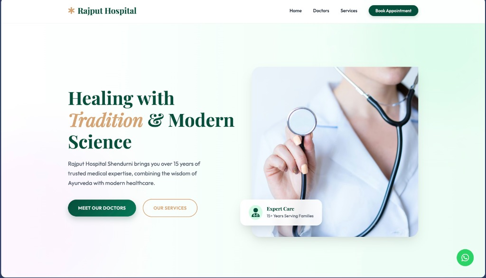

# 🏥 Rajput Hospital Shendurni

<div align="center">



**Healing with Tradition & Modern Science**

[](https://rajput-hospital-shendurni.netlify.app)
[](LICENSE)
[](https://nodejs.org)
[](https://www.mongodb.com)

</div>

---

## 📋 Overview

Rajput Hospital Shendurni is a modern, full-stack healthcare website that bridges traditional Ayurvedic medicine (BAMS) with contemporary medical practices. With over 15 years of trusted medical expertise, this platform provides patients with an intuitive interface to learn about services, meet our doctors, and book appointments seamlessly.

## ✨ Features

### 🎨 **Modern & Responsive Design**
- Beautiful gradient-based UI with glassmorphism effects
- Fully responsive across all devices (mobile, tablet, desktop)
- Smooth animations and micro-interactions
- Dark teal color scheme for a professional medical aesthetic

### 👨‍⚕️ **Doctor Profiles**
- Detailed profiles of BAMS-qualified doctors
- 15+ years of experience highlighted
- Specializations and expertise showcase

### 📅 **Appointment Booking System**
- Real-time appointment scheduling
- MongoDB Atlas integration for data persistence
- Form validation and error handling
- Instant booking confirmations

### 🔐 **Admin Dashboard**
- Secure admin panel for appointment management
- View, manage, and track all patient appointments
- Real-time data synchronization

### 💬 **WhatsApp Integration**
- Direct WhatsApp contact button
- Quick patient communication channel

## 🛠️ Tech Stack

### **Frontend**
- HTML5
- CSS3 (Vanilla CSS with modern features)
- JavaScript (ES6+)

### **Backend**
- Node.js
- Express.js
- MongoDB Atlas (Database)
- Mongoose (ODM)

### **Deployment**
- Vercel (Hosting & Serverless Functions)

### **Additional Tools**
- CORS (Cross-Origin Resource Sharing)
- dotenv (Environment Variables)

## 🚀 Getting Started

### Prerequisites

- Node.js (v18 or higher)
- npm or yarn
- MongoDB Atlas account

### Installation

1. **Clone the repository**
   ```bash
   git clone https://github.com/omrajputt369-byte/rajput-hospital-shendurni.git
   cd rajput-hospital-shendurni
   ```

2. **Install dependencies**
   ```bash
   npm install
   ```

3. **Set up environment variables**
   
   Create a `.env` file in the root directory:
   ```env
   MONGODB_URI=your_mongodb_atlas_connection_string
   PORT=3000
   ```

4. **Run the development server**
   ```bash
   node server.js
   ```

5. **Open your browser**
   
   Navigate to `http://localhost:3000`

## 📁 Project Structure

```
rajput-hospital-shendurni/
├── assets/              # Images and media files
├── node_modules/        # Dependencies
├── .env                 # Environment variables (not in repo)
├── .gitignore          # Git ignore rules
├── admin.html          # Admin dashboard page
├── admin.js            # Admin dashboard logic
├── index.html          # Main landing page
├── main.js             # Client-side JavaScript
├── package.json        # Project metadata & dependencies
├── server.js           # Express server & API routes
├── style.css           # Main stylesheet
├── vercel.json         # Vercel deployment configuration
└── README.md           # Project documentation
```

## 🌐 Deployment

This project is deployed on **Vercel** with serverless functions handling the backend API.

### Deploy Your Own

[](https://vercel.com/new/clone?repository-url=https://github.com/omrajputt369-byte/rajput-hospital-shendurni)

### Manual Deployment

1. Install Vercel CLI:
   ```bash
   npm install -g vercel
   ```

2. Deploy:
   ```bash
   vercel
   ```

3. Set environment variables in Vercel dashboard:
   - `MONGODB_URI`

## 🔒 Environment Variables

| Variable | Description | Required |
|----------|-------------|----------|
| `MONGODB_URI` | MongoDB Atlas connection string | Yes |
| `PORT` | Server port (default: 3000) | No |

## 📸 Screenshots

### Home Page


*Healing with Tradition & Modern Science - Over 15 years of trusted medical expertise*

## 🎯 Key Highlights

- ✅ **15+ Years** of medical expertise
- ✅ **BAMS Qualified** doctors
- ✅ **Traditional + Modern** healthcare approach
- ✅ **Real-time** appointment booking
- ✅ **Secure** admin management system
- ✅ **Mobile-first** responsive design

## 🤝 Contributing

Contributions, issues, and feature requests are welcome!

1. Fork the project
2. Create your feature branch (`git checkout -b feature/AmazingFeature`)
3. Commit your changes (`git commit -m 'Add some AmazingFeature'`)
4. Push to the branch (`git push origin feature/AmazingFeature`)
5. Open a Pull Request

## 📝 License

This project is licensed under the MIT License - see the [LICENSE](LICENSE) file for details.

## 👨‍💻 Author

**Om Rajput**

- GitHub: [@omrajputt369-byte](https://github.com/omrajputt369-byte)
- Website: [rajput-hospital-shendurni.netlify.app](https://rajput-hospital-shendurni.netlify.app/)

## 🙏 Acknowledgments

- Designed for Rajput Hospital Shendurni
- Built with ❤️ for better healthcare accessibility
- Special thanks to all contributors and supporters

---

<div align="center">

**Made By om  for Rajput Hospital Shendurni**

[Visit Website](https://rajput-hospital-shendurni.netlify.app) • [Report Bug](https://github.com/omrajputt369-byte/rajput-hospital-shendurni/issues) • [Request Feature](https://github.com/omrajputt369-byte/rajput-hospital-shendurni/issues)

</div>
